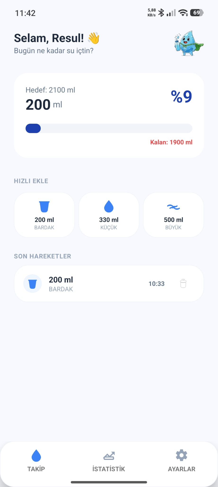
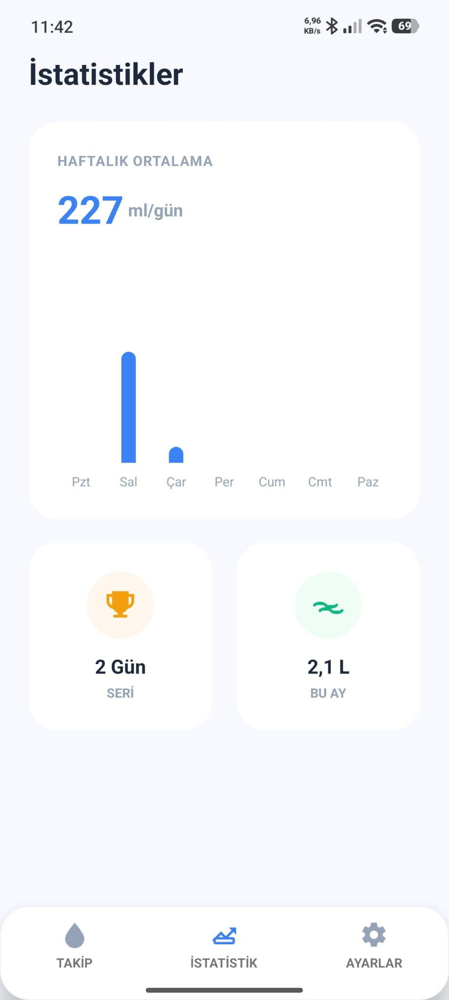
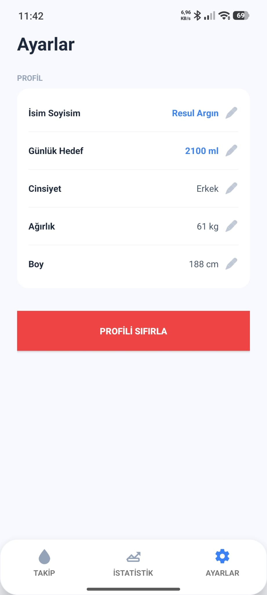

# Watever - Smart Water Tracker 💧

**Watever** is a modern Android application developed to help users track and manage their daily hydration goals. Built with a focus on user experience and technical precision, it calculates personalized goals and provides interactive visual feedback.


## 🚀 Key Features

* **Dynamic Goal Calculation:** Automatically calculates your daily water target using physiological formulas:
    * Weight (kg) × 35ml
* **Interactive Analytics:** A custom-built weekly bar chart with **Touch Interaction**. 
    * *Press and hold* any bar to see the exact intake value in a dynamic popup.
    * The popup automatically hides when you release your finger.
* **Smart Reminders:** Integrated notification system that triggers every 2 hours.
    * **Sleep Mode (UX):** Notifications are automatically silenced between **11 PM and 8 AM**.
    * **Varied Messaging:** Cycles through 8 different motivational messages.
* **Intake Management:** Quick-add buttons for common volumes (200ml, 330ml, 500ml) and a history log with the ability to delete entries.
* **Visual Progress:** Animated progress bar that caps at 100% to maintain a clean UI once the daily goal is reached.

## 🛠 Technical Stack

* **Language:** Java
* **Platform:** Android Studio (Target API 34+)
* **Persistence:** `SharedPreferences` with JSON serialization for complex history data.
* **Background Processing:** `AlarmManager` and `BroadcastReceiver` for scheduled tasks.
* **UI/UX Components:** * `RecyclerView` with custom adapters and item deletion logic.
    * `MotionEvent` handling for interactive charts.
    * `ObjectAnimator` for smooth progress transitions.
    * `CardView` and custom XML shape drawables.

## 📸 Screenshots

## 📸 Screenshots

<p align="center">
  
  
  
</p>


## 📋 How to Run

1.  Clone the repository:
    ```bash
    git clone [https://github.com/YOUR_USERNAME/Watever.git](https://github.com/YOUR_USERNAME/Watever.git)
    ```
2.  Open in **Android Studio**.
3.  Connect your Android device or start an emulator.
4.  Build and Run.

## 🧑‍💻 Author

**Resul Argın** *Electrical and Electronics Engineering Student @ Marmara University*
